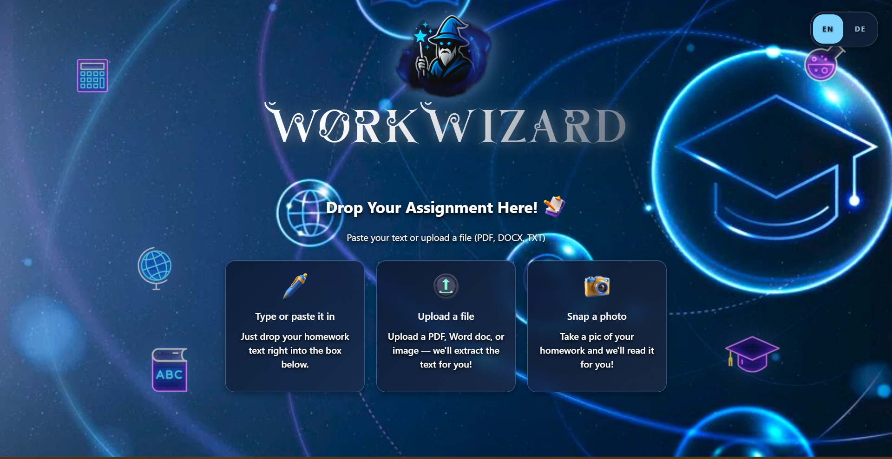
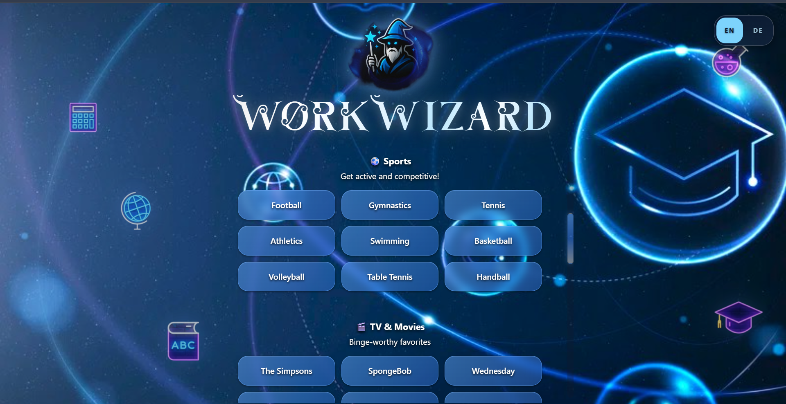
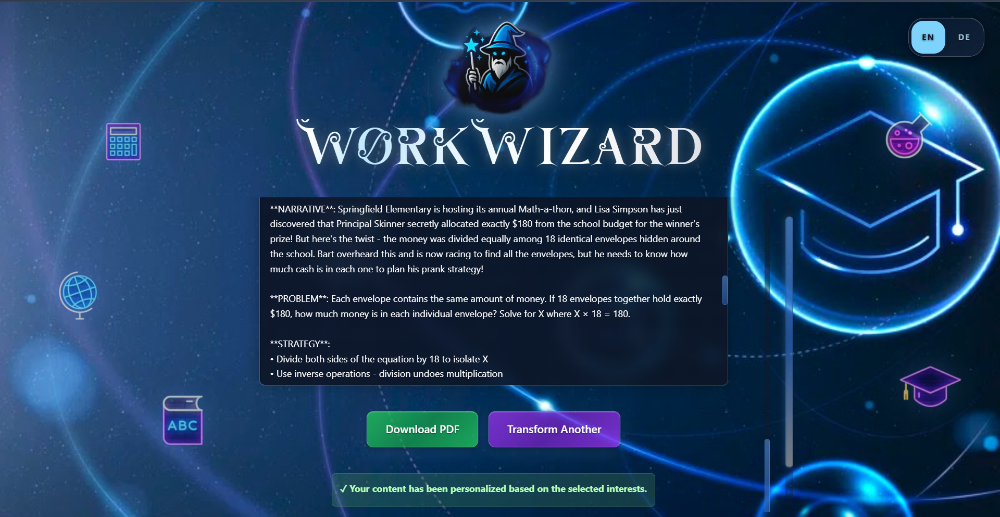

<div align="center">

<a href="https://github.com/Made-in-Jurgistan/workwizard-public">
  
</a>

<br />


<br />

<p align="right">
  
</p>

<p>
  <strong>Worksheets rewritten around what each student cares about</strong>
</p>

<p>
  A teacher uploads a worksheet, each student picks the topics they love, and every exercise is rewritten<br />
  around them. The learning goal stays the same, the answers stay hidden, and the result is printed.
</p>

<p>
  <a href="https://github.com/Made-in-Jurgistan/workwizard-public/actions/workflows/ci.yml"></a>
  <a href="https://python.org"></a>
  <a href="https://react.dev"></a>
  <a href="https://fastapi.tiangolo.com"></a>
  <a href="LICENSE.md"></a>
</p>

<p>
  Survey: <a href="https://workwizard-demo.vercel.app/survey">workwizard-demo.vercel.app/survey</a>
</p>

</div>

<br />

<div align="center">

| Upload | Choose interests | Personalised exercise |
| :---: | :---: | :---: |
|  |  |  |
| PDF, Word file or photo | 54 interests, no account needed | Same goal, answers hidden |

</div>

<br />

## Contents

- [Why WorkWizard](#why-workwizard)
- [How it works](#how-it-works)
- [Features](#features)
- [The research behind it](#the-research-behind-it)
- [Architecture](#architecture)
- [API](#api)
- [Security](#security)
- [Documentation](#documentation)
- [Contributing](#contributing)
- [Changelog](#changelog)
- [License](#license)

> **About this repository:** This is WorkWizard's public repository. It holds documentation, brand assets and research papers. The source code, architecture decision records and operational data live in a separate private repository.

## Why WorkWizard

Children learn a lot of what sticks while they practise, and practice is often where they switch off. A teacher can't write a Minecraft version of a geometry sheet for one child and a Marvel version for another, so the whole class gets the same page.

WorkWizard does that rewriting. It takes the teacher's own worksheet and rewrites each exercise around an interest the student picked. Software checks that each rewritten exercise still asks for the same thing and doesn't give the answer away. The result is a PDF that the teacher can look over and print, and the student works on paper. We don't yet know whether this makes students more engaged or helps them learn more; a school pilot will measure that.

WorkWizard is built for German schools, works in German and English, and adjusts to seven age groups from grade 1 to grade 13.

> **Status:** Version `0.1.0`. An early product that we are still improving and that has not yet been piloted in a school. The website runs on Vercel and the server on Railway.

## How it works

```text
Upload  ──▶  Choose interests  ──▶  Rewrite  ──▶  Check  ──▶  Print
```

| Step | What happens |
| --- | --- |
| **Upload** | The teacher uploads a PDF, Word file, photo or text file. Mistral OCR reads the text. Where data protection rules require it, a self-hosted reader (MinerU) can be used instead. |
| **Choose interests** | The student picks up to five of 54 interests in six groups, all available in German and English. |
| **Rewrite** | Kimi K2.6 rewrites each exercise around the student's interests. A bare sum such as `7 × 8` gets a short story around it, and the original sum is then shown unchanged. |
| **Check** | Each rewritten exercise is checked in code: is the original task intact, has an answer leaked, is it too long? An exercise that fails keeps its original text. The teacher sees the original and the new version side by side. |
| **Print** | WeasyPrint produces a PDF laid out for the student's age group. The layouts are tested against accessibility guidelines; we don't claim full compliance until an independent audit has been done. |

## Features

| Feature | What it means |
| --- | --- |
| **Interests** | 54 interests in six groups (games, sports, TV and film, fantasy and adventure, superheroes, making things), each with its own characters, missions, settings and details in German and English |
| **Age groups** | Seven age groups (grades 1–2 to grade 13), each with its own sentence length, level of support and type of thinking asked for |
| **Answers stay hidden** | The model never receives the answer, and a check in German and English rejects any output that gives a solution away |
| **Quality checks** | Every exercise is accepted or rejected in code. In the per-exercise engine, an AI reviewer also scores each exercise, followed by at most one repair attempt. An exercise that never passes is replaced by the original. A separate evaluation harness measures recorded runs on a fixed set of real worksheets, including how consistent repeated runs are. |
| **Story details** | Characters and settings come from a curated collection, with topics unsuitable for younger children filtered out |
| **Variety** | Story settings change across a worksheet so exercises don't repeat each other |
| **Two engines** | Chosen in configuration: a per-exercise engine, or an agent engine that works through groups of tasks with tools, keeps the source text as it is and checks every task in code. Both finish with the same answer check. |
| **Accessible PDFs** | WeasyPrint and Jinja2 templates with layouts per age group, tested against [WCAG 2.2](https://www.w3.org/TR/WCAG22/) level AA criteria; no compliance claim without an audit |
| **Made for paper** | The computer is used to make the worksheet; the student works on paper |

## The research behind it

<details>
<summary><strong>Show the 13 frameworks</strong></summary>
<br />

WorkWizard's design draws on 13 frameworks from learning science and motivation research, expressed in the software as 16 labels (three of them are parts of self-determination theory, and scaffolding is part of the zone of proximal development). The per-exercise engine picks labels according to the type of content. The agent engine uses up to eight of them on each task: autonomy, narrative transportation, prior knowledge and cognitive load for the story setting, and scaffolding, the zone of proximal development, worked examples and metacognition for hints.

| Framework | Main source | What it shapes |
| --- | --- | --- |
| Cognitive load theory | Sweller (1988) | How much each step asks a student to hold in mind |
| Zone of proximal development | Vygotsky (1978) | How much help a hint gives |
| Bloom's taxonomy | Anderson & Krathwohl (2001) | What kind of thinking a task asks for |
| Self-determination theory | Ryan & Deci (2000, 2017) | Choice and interest as sources of motivation |
| Flow | Csikszentmihalyi (1990) | Keeping a task hard enough to engage without frustrating |
| Growth mindset | Dweck (2006) | Praising effort and method, not just results |
| Discovery learning | Bruner (1961) | Guiding students with questions |
| Dual coding | Paivio (1971); Mayer (2009) | Pairing words with pictures, more for younger children |
| Narrative transportation | Green & Brock (2000) | How a story can draw a reader in |
| Worked examples | Sweller (2011) | Fully worked steps first, removed over time |
| Prior knowledge | Ausubel (1968) | Linking new ideas to what the student already knows |
| Metacognition | Flavell (1979); Schraw & Dennison (1994) | Prompts to plan and check one's own work |
| Cognitive activation | Burge, Lenkeit & Sizmur (2015) | Asking students to reason, not only to recall |

In the per-exercise engine, five further techniques switch on when the age group and type of content call for them: how difficulty is framed, linking the task to something the student values, how success and mistakes are explained, whether practice is grouped or mixed, and worked examples. Three more (self-explanation prompts, a choice of how to answer, and spaced review for returning students) are built but switched off.

The research on these ideas, with sources and limits, is summarised in the [K-12 frameworks report](docs/research/k12-pedagogical-frameworks.md). These frameworks inform the design. They are not evidence that WorkWizard itself improves results.

</details>

## Architecture

```text
      ┌─────────────┐              ┌─────────────┐              ┌─────────────┐
      │  Frontend   │─────────────▶│   Backend   │─────────────▶│  Supabase   │
      │  React 19   │              │   FastAPI   │              │  Postgres   │
      │  Vite / TS  │              │   uvicorn   │              └─────────────┘
      └─────────────┘              └──────┬──────┘
                                           │
                          ┌────────────────┼────────────────┐
                    ┌─────▼─────┐    ┌─────▼─────┐    ┌─────▼─────┐
                    │  Mistral  │    │  Kimi K2  │    │  OpenAI   │
                    │    OCR    │    │ Transform │    │ GPT Image │
                    └───────────┘    └───────────┘    └───────────┘
```

<details>
<summary><strong>Backend pipeline stages</strong></summary>
<br />

| Stage | Role |
| --- | --- |
| Extraction | Document to structured text (Mistral OCR, MinerU fallback) |
| Language detection | EN/DE heuristic with no external dependencies |
| Grade detection | Readability, vocabulary and maths-complexity signals |
| Enrichment | Interest characters, settings and details from a curated knowledge base |
| Prompt building | Prompts built for grade, subject and teaching approach, with a check against repeated story settings |
| Transformation | Kimi K2.6 (256K context): parallel per-exercise calls with admission control, or tool-assisted agent sessions over groups of tasks; progress streamed over SSE |
| Quality gate | Answer-leak detection and source-correspondence checks on every output; AI judge and at most one repair on the per-exercise engine; acceptance in code per task on the agent engine |
| PDF generation | WeasyPrint and Jinja2 with CSS per grade band; optional illustrations via OpenAI GPT Image |

</details>

### Tech stack

| Layer | Technology |
| --- | --- |
| Frontend | React 19, TypeScript 5.9, Vite 7.3, i18n DE/EN |
| Backend | Python 3.12, FastAPI 0.115+, Pydantic v2, structlog |
| AI | Kimi K2.6 (Moonshot AI, 256K context, instant mode), Mistral OCR, OpenAI GPT Image 1.5 Mini (PDF illustrations) |
| Data | Supabase Postgres (pgvector provisioned; retrieval is deterministic key lookup) |
| Testing | pytest (about 5,800 tests in 145 modules), Vitest (742 tests in 41 files) and Playwright (6 specs) |
| Infrastructure | Docker Compose, nginx, GitHub Actions, Vercel, Railway |

## API

Routes are mounted under `/api/v1/...`. Probes: `GET /healthz` (liveness), `GET /readyz` (readiness), `GET /health` (diagnostics).

| Method | Endpoint | Description |
| --- | --- | --- |
| `GET` | `/healthz` | Liveness |
| `GET` | `/readyz` | Readiness (warmup + accepting traffic) |
| `GET` | `/health` | Service and dependency diagnostics |
| `POST` | `/api/v1/upload` | Upload PDF, DOCX, TXT, or image (max 10 MB) |
| `GET` | `/api/v1/interests/catalog` | Interest catalog with metadata |
| `POST` | `/api/v1/ai-transformation/transform` | Transform exercises |
| `POST` | `/api/v1/ai-transformation/transform/stream` | Transform with SSE progress streaming |
| `POST` | `/api/v1/pdf/generate` | Generate PDF (returns cache key / URL) |
| `GET` | `/api/v1/pdf/download/{cache_key}` | Download a generated PDF |
| `POST` | `/api/v1/survey/submit` | Submit an anonymous survey response |
| `POST` | `/api/v1/survey/event` | Record an anonymous survey funnel event |
| `POST` | `/api/v1/survey/contact` | Submit a survey contact message |

Admin-token routes cover survey administration (including erasure of one respondent's data), quality review and cache invalidation. Some deployments protect cost-bearing routes with an optional shared API key. The interactive reference is at `/docs` when enabled.

## Security

- Credentials only in environment variables; no secrets in source
- Per-IP rate limiting on transform, upload, PDF and interest routes
- Explicit CORS allowlist, no wildcard in production
- Non-root containers and digest-pinned base images
- Pydantic v2 validation at every request boundary
- Static security analysis (bandit) on every CI run
- Request time limits so workers can't be tied up (about 280 s for normal requests; longer for streamed progress on large worksheets)
- Survey: no IP address or user agent stored, contact details only with recorded consent, erasure of one respondent's data on request, 18-month retention
- No user accounts in v0.1.0; the pilot will run with teachers supervising access

See [SECURITY.md](SECURITY.md) for the full security policy.

## Documentation

- [Architecture overview](ARCHITECTURE.md): system design and tech stack
- [Security policy](SECURITY.md): security approach and how to report a vulnerability
- [Contributing guidelines](CONTRIBUTING.md): bug reports, suggestions and the survey
- [Changelog](CHANGELOG.md): notable changes in each release
- [Research library](docs/research/README.md): index of the public research documents
- [K–12 pedagogical, psychological and engagement frameworks](docs/research/k12-pedagogical-frameworks.md): what learning science says about good worksheets, with sources
- [WorkWizard Research Foundation](docs/research/workwizard-research-foundation.md): the evidence behind the product
- [Press kit](PRESS_KIT.md): boilerplate text, fact sheet, screenshots, brand assets and press FAQ

## Contributing

WorkWizard is proprietary, and we don't accept outside code contributions at the moment. Bug reports and suggestions are welcome through [GitHub Issues](https://github.com/Made-in-Jurgistan/workwizard-public/issues), and anyone can give feedback through the survey at [workwizard-demo.vercel.app/survey](https://workwizard-demo.vercel.app/survey).

See [CONTRIBUTING.md](CONTRIBUTING.md) for details.

## Changelog

See [CHANGELOG.md](CHANGELOG.md) for notable changes in each release.

## License

This software is proprietary and all rights are reserved by the copyright holder. Copying, modifying, distributing or commercially using any part of this repository without permission is not allowed. For licensing questions, email **madeinjurgistan@gmail.com**.

The full terms are in [LICENSE.md](LICENSE.md).

<div align="center">

<sub>Copyright © 2025–2026 Made in Jurgistan. All rights reserved.</sub>

<br />


</div>
